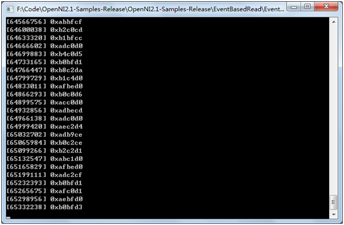
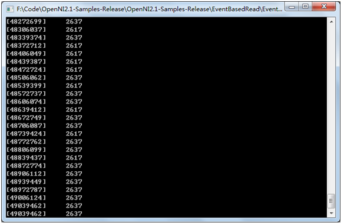

# Code samples

Currently, we have sample code to read the color stream, depth stream, ir stream, and point cloud using the OpenNI2 SDK, as well as to generate and read ONI video files, which will be described in detail below.The following samples are in the OpenNI2 Samples directory of the OpenNI2 SDK. You can use CMake to generate the openni2 examples.sln solution under Windows and the executable files under Linux.

## List of Examples:

| Name                    | System | Language | Description                                       |
| --------------------------- | -------- | ------------------------------------------------------------ | ------------------------------------------------------------ |
| ColorReaderPoll      | Windows | C++        | This sample show how to read a color stream by polling. |
| ColorReaderEvent      | Windows | C++        | This sample show how to read a color stream by event. |
| ColorReaderUVC | Windows | C++        | This sample show how to read a color stream by UVC. |
| DepthReaderPoll | Windows | C++     | This sample show how to read a depth stream by polling.      |
| DepthReaderEvent | Windows | C++        | This sample show how to read a depth stream by event. |
| InfraredReaderPoll | Windows | C++        | This sample show how to read an ir stream by polling. |
| InfraredReaderEvent | Windows | C++        | This sample show how to read an ir stream by event. |
| GeneratePointCloud | Windows | C++        | This sample show how to generate a point cloud from depth frame data. |
| InfraredOniFileRecorder | Windows | C++        | This sample show how to save an ir stream as an Oni file. |
| InfraredOniFileReader | Windows | C++        | This sample show how to read an ir stream from an Oni file. |
| RGBSNReader | Windows | C++ | This sample show how to read SN of RGB. Currently only Astra+ support this interface. |
| HardwareD2C | Windows | C++ | This sample show how to use hardware D2C interface. |
| SoftD2C | Windows | C++ | This sample show how to use software D2C interface. |
| MultiDepthViewer | Windows | C++ | This sample show how to get multiple devices depth data. |
| MultipleStreamRead | Windows | C++ | This sample show how to get multiple stream of single device. |
| ClosestPointViewer | Linux | C++ | This sample show how to get closest point data. |
| EventBasedRead | Linux | C++ | This sample show how to get depth data by event. |
| MultiDepthViewer | Linux | C++ | This sample show how to get multiple devices depth data. |
| MultipleStreamRead | Linux | C++ | This sample show how to get multiple stream of single device. |
| SimpleRead | Linux | C++ | This sample show how to read a depth stream. |
| SimpleViewer | Linux | C++ | This sample show how to read and display a depth stream. |
| RGBSNReader | Linux | C++ | This sample show how to read SN of RGB. Currently only Astra+ support this interface. |
| colorforopenni2 | Android | NDK | This sample show how to read a color stream by NDK. |
| depthforopenni2 | Android | NDK | This sample show how to read a depth stream by NDK. |
| irforopenni2 | Android | NDK | This sample show how to read a ir stream by NDK. |
| colorforopenni2（Java） | Android | Java | This sample show how to read a color stream by Java. |
| depthforopenni2（Java） | Android | Java | This sample show how to read a depth stream by Java. |
| irforopenni2（Java） | Android | Java | This sample show how to read a ir stream by Java. |
| OrbbecStreamSample | Android | Java | This sample show how to read and display depth,color and ir stream. |
| RGBSNReader | Android | Java | This sample show how to read SN of RGB. Currently only Astra+ support this interface. |
# ColorReaderPoll

This sample show how to read a color stream by polling.

## Expected Output



## Code Overview

First, we include the header file.

```cpp
#include <OpenNI.h>
```

Next, we need to initialize the OpenNI2 SDK, get sensor and create reader to read color stream.

```cpp
//initialize openni sdk
Status rc = OpenNI::initialize();
if (rc != STATUS_OK)
{
    printf("Initialize failed\n%s\n", OpenNI::getExtendedError());
    return 1;
}

Device device;

//open device
rc = device.open(ANY_DEVICE);
if (rc != STATUS_OK)
{
    printf("Couldn't open device\n%s\n", OpenNI::getExtendedError());
    return 2;
}

VideoStream color;

//create color stream
if (device.getSensorInfo(SENSOR_COLOR) != NULL)
{
    rc = color.create(device, SENSOR_COLOR);
    if (rc != STATUS_OK)
    {
        printf("Couldn't create depth stream\n%s\n", OpenNI::getExtendedError());
        return 3;
    }
}

//start color stream
rc = color.start();
if (rc != STATUS_OK)
{
	printf("Couldn't start the depth stream\n%s\n", OpenNI::getExtendedError());
    return 4;
}

```

Now, let's see how to get color frame. 

```cpp
VideoFrameRef frame;
RGB888Pixel* pColor;

while (!wasKeyboardHit())
{
    int changedStreamDummy;
    VideoStream* pStream = &color;
    
    //wait a new frame
    rc = OpenNI::waitForAnyStream(&pStream, 1, &changedStreamDummy, SAMPLE_READ_WAIT_TIMEOUT);
    if (rc != STATUS_OK)
    {
        printf("Wait failed! (timeout is %d ms)\n%s\n", SAMPLE_READ_WAIT_TIMEOUT, OpenNI::getExtendedError());
        continue;
    }

    //get color frame
    rc = color.readFrame(&frame);
    if (rc != STATUS_OK)
    {
        printf("Read failed!\n%s\n", OpenNI::getExtendedError());
        continue;
    }

    //check if the frame format is rgb888 frame format
    if (frame.getVideoMode().getPixelFormat() != PIXEL_FORMAT_RGB888)
    {
        printf("Unexpected frame format\n");
        continue;
    }

    int middleIndex = (frame.getHeight() + 1)*frame.getWidth() / 2;

    pColor = (RGB888Pixel*)frame.getData();
    
    //print the r g b value of the middle pixel of the frame
    printf("[%08llu] 0x%02x%02x%02x\n", (long long)frame.getTimestamp(),
        pColor[middleIndex].r&0xff,
        pColor[middleIndex].g&0xff,
        pColor[middleIndex].b&0xff);
}
```

After all, we need to release all resources.

```cpp
//stop color stream
color.stop();

//destroy color stream
color.destroy();

//close device
device.close();

//shutdown OpenNI
OpenNI::shutdown();
```

# ColorReaderEvent

This sample show how to read color stream with OpenNI2 SDK by event.

## Expected Output


## Code Overview

First, we include the header file.

```cpp
#include "OpenNI.h"
```

Next, we need to initialize the OpenNI2 SDK, get sensor and create reader to read color stream.

```cpp
//initialize openNI sdk
Status rc = OpenNI::initialize();
if (rc != STATUS_OK)
{
    printf("Initialize failed\n%s\n", OpenNI::getExtendedError());
    return 1;
}

//open deivce
Device device;
rc = device.open(ANY_DEVICE);
if (rc != STATUS_OK)
{
    printf("Couldn't open device\n%s\n", OpenNI::getExtendedError());
    return 2;
}

VideoStream color;

//create color stream
if (device.getSensorInfo(SENSOR_COLOR) != NULL)
{
    rc = color.create(device, SENSOR_COLOR);
    if (rc != STATUS_OK)
    {
        printf("Couldn't create depth stream\n%s\n", OpenNI::getExtendedError());
    }
}

//start color stream
rc = color.start();
if (rc != STATUS_OK)
{
    printf("Couldn't start the depth stream\n%s\n", OpenNI::getExtendedError());
}

```

Then, we register a callback to receive color frame.

```cpp

void analyzeFrame(const VideoFrameRef& frame)
{
	RGB888Pixel* pColor;

	int middleIndex = (frame.getHeight()+1)*frame.getWidth()/2;

	switch (frame.getVideoMode().getPixelFormat())
	{
	case PIXEL_FORMAT_RGB888:
		pColor = (RGB888Pixel*)frame.getData();
		printf("[%08llu] 0x%02x%02x%02x\n", (long long)frame.getTimestamp(),
			pColor[middleIndex].r&0xff,
			pColor[middleIndex].g&0xff,
			pColor[middleIndex].b&0xff);
		break;
	default:
		printf("Unknown format\n");
	}
}

class PrintCallback : public VideoStream::NewFrameListener
{
public:
	void onNewFrame(VideoStream& stream)
	{
		stream.readFrame(&m_frame);

		analyzeFrame(m_frame);
	}
private:
	VideoFrameRef m_frame;
};

PrintCallback colorPrinter;

// Register frame listener
color.addNewFrameListener(&colorPrinter);

```

Need to call update.

```cpp
// Wait while we're getting frames through the printer
while (!wasKeyboardHit())
{
    Sleep(100);
}
```

Once we don't need to receive frame anymore, remove listener.

```cpp
color.removeNewFrameListener(&colorPrinter);
```

After all, we need to release all resources.

```cpp
//stop color stream
color.stop();

//destroy color stream
color.destroy();

//close device
device.close();

//shutdown OpenNI
OpenNI::shutdown();
```

# ColorReaderUVC

## Overview

This sample show how to use OpenCV to open the UVC protocol's color camera and read the color stream.

## Expected Output


## Code Overview

The OpenNI2 SDK does not support the color camera of the standard UVC protocol, so we provide a way to access the UVC color camera based on the VideoCapture class in OpenCV.

First, we include the header file.

```cpp
#include <opencv2/opencv.hpp>
```

Next, we need to create a cv::VideoCapture object and open the UVC camera.
```cpp

using namespace cv;

int main()
{
	VideoCapture videoCapture;

	videoCapture.open(0); 
	if (!videoCapture.isOpened())
	{
		printf("open UVC color camera failed.");
	}

	return 0;
}
```

Now, we set the video encoding format and resolution.

```cpp
using namespace cv;

int main()
{
	VideoCapture videoCapture;

	videoCapture.open(0);
	if (!videoCapture.isOpened())
	{
		printf("open UVC color camera failed.");
	}

	//set codec format
	videoCapture.set(CV_CAP_PROP_FOURCC, CV_FOURCC('M', 'J', 'P', 'G'));
	
	//set resolution
	videoCapture.set(CV_CAP_PROP_FRAME_WIDTH, 640);
	videoCapture.set(CV_CAP_PROP_FRAME_HEIGHT, 480);

	return 0;
}

```

Finally, we read the color video stream and print out the values of the r, g, and b components of the middle pixel.

```cpp
using namespace cv;

int main()
{
	VideoCapture videoCapture;

	videoCapture.open(cv::CAP_ANY);
	if (!videoCapture.isOpened())
	{
		printf("open UVC color camera failed.");
	}

	//set codec format
	videoCapture.set(CV_CAP_PROP_FOURCC, CV_FOURCC('M', 'J', 'P', 'G'));
	
	//set resolution
	videoCapture.set(CV_CAP_PROP_FRAME_WIDTH, 640);
	videoCapture.set(CV_CAP_PROP_FRAME_HEIGHT, 480);

	while (true)
	{
		Mat frame; 
		videoCapture >> frame; 
		
		Vec3b &bgr = frame.at<Vec3b>(frame.rows/2, frame.cols/2);

		//print the r g b value of the middle pixel of the frame
		printf("r = %02d, g = %02d, b = %02d\n",
			bgr[2] & 0xff,
			bgr[1] & 0xff,
			bgr[0] & 0xff);

		waitKey(30); //delay 30ms
	}

	return 0;
}

```

# DepthReaderPoll

## Overview

This sample show how to read a depth stream by polling.

## Expected Output



## Code Overview

First, we include the header file.

```cpp
#include <OpenNI.h>
```

Next, we need to initialize the OpenNI2 SDK, get sensor and create reader to read depth stream.

```cpp
//initialize openni sdk
Status rc = OpenNI::initialize();
if (rc != STATUS_OK)
{
    printf("Initialize failed\n%s\n", OpenNI::getExtendedError());
    return 1;
}

Device device;

//open device
rc = device.open(ANY_DEVICE);
if (rc != STATUS_OK)
{
    printf("Couldn't open device\n%s\n", OpenNI::getExtendedError());
    return 2;
}

VideoStream depth;

//create depth stream
if (device.getSensorInfo(SENSOR_DEPTH) != NULL)
{
    rc = depth.create(device, SENSOR_DEPTH);
    if (rc != STATUS_OK)
    {
        printf("Couldn't create depth stream\n%s\n", OpenNI::getExtendedError());
        return 3;
    }
}

//start depth stream
rc = depth.start();
if (rc != STATUS_OK)
{
	printf("Couldn't start the depth stream\n%s\n", OpenNI::getExtendedError());
    return 4;
}

```

Now, let's see how to get depth frame. 

```cpp
VideoFrameRef frame;

while (!wasKeyboardHit())
{
    int changedStreamDummy;
    VideoStream* pStream = &depth;
    
    //wait a new frame
    rc = OpenNI::waitForAnyStream(&pStream, 1, &changedStreamDummy, SAMPLE_READ_WAIT_TIMEOUT);
    if (rc != STATUS_OK)
    {
        printf("Wait failed! (timeout is %d ms)\n%s\n", SAMPLE_READ_WAIT_TIMEOUT, OpenNI::getExtendedError());
        continue;
    }

    //get depth frame
    rc = depth.readFrame(&frame);
    if (rc != STATUS_OK)
    {
        printf("Read failed!\n%s\n", OpenNI::getExtendedError());
        continue;
    }

    //check if the frame format is depth frame format
    if (frame.getVideoMode().getPixelFormat() != PIXEL_FORMAT_DEPTH_1_MM && frame.getVideoMode().getPixelFormat() != PIXEL_FORMAT_DEPTH_100_UM)
    {
        printf("Unexpected frame format\n");
        continue;
    }

    DepthPixel* pDepth = (DepthPixel*)frame.getData();

    int middleIndex = (frame.getHeight() + 1)*frame.getWidth() / 2;

    //print the depth value of the middle pixel of the frame
    printf("[%08llu] %8d\n", (long long)frame.getTimestamp(), pDepth[middleIndex]);
}
```

After all, we need to release all resources.

```cpp
//stop depth stream
depth.stop();

//destroy depth stream
depth.destroy();

//close device
device.close();

//shutdown OpenNI
OpenNI::shutdown();
```

# DepthReaderEvent

## Overview

This sample show how to read a depth stream by event.

## Expected Output


## Code Overview

First, we include the header file.

```cpp
#include "OpenNI.h"
```

Next, we need to initialize the OpenNI2 SDK, get sensor and create reader to read depth stream.

```cpp
//initialize openNI sdk
Status rc = OpenNI::initialize();
if (rc != STATUS_OK)
{
    printf("Initialize failed\n%s\n", OpenNI::getExtendedError());
    return 1;
}

//open deivce
Device device;
rc = device.open(ANY_DEVICE);
if (rc != STATUS_OK)
{
    printf("Couldn't open device\n%s\n", OpenNI::getExtendedError());
    return 2;
}

VideoStream depth;

//create depth stream
if (device.getSensorInfo(SENSOR_DEPTH) != NULL)
{
    rc = depth.create(device, SENSOR_DEPTH);
    if (rc != STATUS_OK)
    {
        printf("Couldn't create depth stream\n%s\n", OpenNI::getExtendedError());
    }
}

//start depth stream
rc = depth.start();
if (rc != STATUS_OK)
{
    printf("Couldn't start the depth stream\n%s\n", OpenNI::getExtendedError());
}

```

Then, we register a callback to receive depth frame.

```cpp
void analyzeFrame(const VideoFrameRef& frame)
{
	DepthPixel* pDepth;
	
	int middleIndex = (frame.getHeight()+1)*frame.getWidth()/2;

	switch (frame.getVideoMode().getPixelFormat())
	{
	case PIXEL_FORMAT_DEPTH_1_MM:
	case PIXEL_FORMAT_DEPTH_100_UM:
		pDepth = (DepthPixel*)frame.getData();
		printf("[%08llu] %8d\n", (long long)frame.getTimestamp(),
			pDepth[middleIndex]);
		break;
	default:
		printf("Unknown format\n");
	}
}

class PrintCallback : public VideoStream::NewFrameListener
{
public:
	void onNewFrame(VideoStream& stream)
	{
		stream.readFrame(&m_frame);

		analyzeFrame(m_frame);
	}
private:
	VideoFrameRef m_frame;
};

PrintCallback depthPrinter;

// Register frame listener
depth.addNewFrameListener(&depthPrinter);

```

Need to call update.

```cpp
// Wait while we're getting frames through the printer
while (!wasKeyboardHit())
{
    Sleep(100);
}
```

Once we don't need to receive frame anymore, unregister callback.

```cpp
depth.removeNewFrameListener(&depthPrinter);
```

After all, we need to release all resources.

```cpp
//stop depth stream
depth.stop();

//destroy depth stream
depth.destroy();

//close device
device.close();

//shutdown OpenNI
OpenNI::shutdown();
```

# InfraredReaderPoll

## Overview

This sample show how to read an ir stream by polling.

## Expected Output


## Code Overview

First, we include the header file.

```cpp
#include <OpenNI.h>
```

Next, we need to initialize the OpenNI2 SDK, get sensor and create reader to read infrared stream.

```cpp
//initialize openni sdk
Status rc = OpenNI::initialize();
if (rc != STATUS_OK)
{
    printf("Initialize failed\n%s\n", OpenNI::getExtendedError());
    return 1;
}

Device device;

//open device
rc = device.open(ANY_DEVICE);
if (rc != STATUS_OK)
{
    printf("Couldn't open device\n%s\n", OpenNI::getExtendedError());
    return 2;
}

VideoStream ir;

//create depth stream
if (device.getSensorInfo(SENSOR_IR) != NULL)
{
    rc = ir.create(device, SENSOR_IR);
    if (rc != STATUS_OK)
    {
        printf("Couldn't create ir stream\n%s\n", OpenNI::getExtendedError());
        return 3;
    }
}

//start ir stream
rc = ir.start();
if (rc != STATUS_OK)
{
	printf("Couldn't start the ir stream\n%s\n", OpenNI::getExtendedError());
    return 4;
}

```

Now, let's see how to get infrared frame.

```cpp
VideoFrameRef frame;

while (!wasKeyboardHit())
{
    int changedStreamDummy;
    VideoStream* pStream = &ir;
    
    //wait a new frame
    rc = OpenNI::waitForAnyStream(&pStream, 1, &changedStreamDummy, SAMPLE_READ_WAIT_TIMEOUT);
    if (rc != STATUS_OK)
    {
        printf("Wait failed! (timeout is %d ms)\n%s\n", SAMPLE_READ_WAIT_TIMEOUT, OpenNI::getExtendedError());
        continue;
    }

    //get depth frame
    rc = ir.readFrame(&frame);
    if (rc != STATUS_OK)
    {
        printf("Read failed!\n%s\n", OpenNI::getExtendedError());
        continue;
    }

    //check if the frame format is infrared frame format
    if (frame.getVideoMode().getPixelFormat() != PIXEL_FORMAT_GRAY16)
    {
        printf("Unexpected frame format\n");
        continue;
    }

    Grayscale16Pixel* pIr = (Grayscale16Pixel*)frame.getData();

    int middleIndex = (frame.getHeight() + 1)*frame.getWidth() / 2;

    //print the gray value of the middle pixel of the frame
    printf("[%08llu] %8d\n", (long long)frame.getTimestamp(), pIr[middleIndex]);
}
```

After all, we need to release all resources.

```cpp
//stop ir stream
ir.stop();

//destroy ir stream
ir.destroy();

//close device
device.close();

//shutdown OpenNI
OpenNI::shutdown();
```

# InfraredReaderEvent

## Overview

This sample show how to read an ir stream by event.

## Expected Output


## Code Overview

First, we include the header file.

```cpp
#include "OpenNI.h"
```

Next, we need to initialize the OpenNI2 SDK, get sensor and create reader to read infrared stream.

```cpp
//initialize openNI sdk
Status rc = OpenNI::initialize();
if (rc != STATUS_OK)
{
    printf("Initialize failed\n%s\n", OpenNI::getExtendedError());
    return 1;
}

//open deivce
Device device;
rc = device.open(ANY_DEVICE);
if (rc != STATUS_OK)
{
    printf("Couldn't open device\n%s\n", OpenNI::getExtendedError());
    return 2;
}

VideoStream ir;

//create depth stream
if (device.getSensorInfo(SENSOR_IR) != NULL)
{
    rc = ir.create(device, SENSOR_IR);
    if (rc != STATUS_OK)
    {
        printf("Couldn't create ir stream\n%s\n", OpenNI::getExtendedError());
    }
}

//start ir stream
rc = ir.start();
if (rc != STATUS_OK)
{
    printf("Couldn't start the ir stream\n%s\n", OpenNI::getExtendedError());
}

```

Then, we register a callback to receive infrared frame.

```cpp
void analyzeFrame(const VideoFrameRef& frame)
{
	Grayscale16Pixel* pIR;

	int middleIndex = (frame.getHeight()+1)*frame.getWidth()/2;

	switch (frame.getVideoMode().getPixelFormat())
	{
	case PIXEL_FORMAT_GRAY16:
		pIR = (Grayscale16Pixel*)frame.getData();
		printf("[%08llu] %8d\n", (long long)frame.getTimestamp(),
			pIR[middleIndex]);
		break;
	default:
		printf("Unknown format\n");
	}
}

class PrintCallback : public VideoStream::NewFrameListener
{
public:
	void onNewFrame(VideoStream& stream)
	{
		stream.readFrame(&m_frame);

		analyzeFrame(m_frame);
	}
private:
	VideoFrameRef m_frame;
};

PrintCallback irPrinter;

// Register frame listener
ir.addNewFrameListener(&irPrinter);

```

Need to call update.

```cpp
// Wait while we're getting frames through the printer
while (!wasKeyboardHit())
{
    Sleep(100);
}
```

Once we don't need to receive frame anymore, unregister callback.

```cpp
ir.removeNewFrameListener(&irPrinter);
```

After all, we need to release all resources.

```cpp
//stop ir stream
ir.stop();

//destroy ir stream
ir.destroy();

//close device
device.close();

//shutdown OpenNI
OpenNI::shutdown();
```

# GeneratePointCloud

## Overview

This sample show how to generate a point cloud from depth frame data and save the point cloud in the form of ply. In this sample, 50 depth frames are read and each depth frame is converted into a point cloud and saved in ply format.

## Expected Output

Generate 50 point cloud files in ply format.

## Code Overview

First, we include the header file.

```cpp
#include "OpenNI.h"
```

Next, declare a structure to hold the internal reference data and define a global object to hold the internal reference data retrieved from the camera.

```cpp
typedef struct xnIntrinsic_Params
{
	xnIntrinsic_Params() :
		c_x(320.0), c_y(240.0), f_x(480.0), f_y(480.0)
	{}

	xnIntrinsic_Params(float c_x_, float c_y_, float f_x_, float f_y_) :
		c_x(c_x_), c_y(c_y_), f_x(f_x_),f_y(f_y_)
	{}

	float c_x; //u axis Normalized focal length
	float c_y; //v axis Normalized focal length
	float f_x; //x coordinate of Principal point
	float f_y; //y coordinate of Principal point
}xIntrinsic_Params;

xIntrinsic_Params g_IntrinsicParam; 
```
Next, we need to initialize the OpenNI2 SDK, open the device, create and launch the depth stream and get the camera internal parameters.
```cpp
//initialize openNI sdk
Status rc = OpenNI::initialize();
if (rc != STATUS_OK)
{
    printf("Initialize failed\n%s\n", OpenNI::getExtendedError());
    return 1;
}

//open deivce
Device device;
rc = device.open(ANY_DEVICE);
if (rc != STATUS_OK)
{
    printf("Couldn't open device\n%s\n", OpenNI::getExtendedError());
    return 2;
}

VideoStream depth;

//create depth stream
if (device.getSensorInfo(SENSOR_DEPTH) != NULL)
{
    rc = depth.create(device, SENSOR_DEPTH);
    if (rc != STATUS_OK)
    {
        printf("Couldn't create depth stream\n%s\n", OpenNI::getExtendedError());
    }
}

//start depth stream
rc = depth.start();
if (rc != STATUS_OK)
{
    printf("Couldn't start the depth stream\n%s\n", OpenNI::getExtendedError());
}

PrintCallback depthPrinter;

// Register frame listener
depth.addNewFrameListener(&depthPrinter);

//get intrinsic parameter from device
getCameraParams(device, g_IntrinsicParam);
```
The function getCameraParams to get the camera internal parameters is defined as follows:

```cpp
void getCameraParams(openni::Device& Device, xIntrinsic_Params& IrParam)
{
	OBCameraParams cameraParam;
	int dataSize = sizeof(cameraParam);
	memset(&cameraParam, 0, sizeof(cameraParam));
	openni::Status rc = Device.getProperty(openni::OBEXTENSION_ID_CAM_PARAMS, (uint8_t *)&cameraParam, &dataSize);
	if (rc != openni::STATUS_OK)
	{
		std::cout << "Error:" << openni::OpenNI::getExtendedError() << std::endl;
		return;
	}
	IrParam.f_x = cameraParam.l_intr_p[0]; 
	IrParam.f_y = cameraParam.l_intr_p[1]; 
	IrParam.c_x = cameraParam.l_intr_p[2];
	IrParam.c_y = cameraParam.l_intr_p[3];

	std::cout << "IrParam.f_x = " << IrParam.f_x << std::endl;
	std::cout << "IrParam.f_y = " << IrParam.f_y << std::endl;
	std::cout << "IrParam.c_x = " << IrParam.c_x << std::endl;
	std::cout << "IrParam.c_y = " << IrParam.c_y << std::endl;

}
```
We then register a callback to receive the depth stream data frames and convert the depth data frames to point cloud storage.

```cpp

int g_imageCount = 0; //record total frame number

void analyzeFrame(const VideoFrameRef& frame)
{
	DepthPixel* pDepth;
	
	//construct pointcloud file name
	char plyFileName[256] = { 0 };
	g_imageCount++;
	sprintf_s(plyFileName, "pointcloud_%d.ply", g_imageCount);
	
	int middleIndex = (frame.getHeight()+1)*frame.getWidth()/2;

	switch (frame.getVideoMode().getPixelFormat())
	{
	case PIXEL_FORMAT_DEPTH_1_MM:
		pDepth = (DepthPixel*)frame.getData();
		printf("[%08llu] %8d\n", (long long)frame.getTimestamp(),
			pDepth[middleIndex]);
		//convert depth frame to pointcloud file 
		convertDepthToPointCloud(pDepth, frame.getWidth(), frame.getHeight(), plyFileName);
		
		break;
	default:
		printf("Unknown format\n");
	}
}

class PrintCallback : public VideoStream::NewFrameListener
{
public:
	void onNewFrame(VideoStream& stream)
	{
		stream.readFrame(&m_frame);

		analyzeFrame(m_frame);
	}
private:
	VideoFrameRef m_frame;
};

```

Converts the depth of the frame to the method of point cloud convertDepthToPointCloud are defined as follows:

```cpp

#define MIN_DISTANCE 20  // Unit(mm)
#define MAX_DISTANCE 4000 //Unit(mm)
#define RESOULTION_X 640.0  //calibration resolution
#define RESOULTION_Y 480.0  //calibration resolution

void convertDepthToPointCloud(const uint16_t *pDepth, int width, int height,const char *ply_filename)
{
	if (NULL == pDepth)
	{
		printf("depth frame is NULL!");
		return;
	}
	
	//convert depth frame to pointcloud file 
	FILE *fp;
	
	int res = fopen_s(&fp, ply_filename, "w");

	int valid_count = 0;
	uint16_t max_depth = MAX_DISTANCE;
	uint16_t min_depth = MIN_DISTANCE;

	//count valid frame number
	int img_size = width * height;
	for (int v = 0; v < height; ++v)
	{
		for (int u = 0; u < width; ++u)
		{
			uint16_t depth = pDepth[v * width + u];
			if (depth <= 0 || depth < min_depth || depth > max_depth)
				continue;

			valid_count += 1;
		}
	}

	//head of ply file
	fprintf(fp, "ply\n");
	fprintf(fp, "format ascii 1.0\n");
	fprintf(fp, "element vertex %d\n", valid_count);
	fprintf(fp, "property float x\n");
	fprintf(fp, "property float y\n");
	fprintf(fp, "property float z\n");
	fprintf(fp, "property uchar red\n");
	fprintf(fp, "property uchar green\n");
	fprintf(fp, "property uchar blue\n");
	fprintf(fp, "end_header\n");

	float world_x, world_y, world_z;
	for (int v = 0; v < height; ++v)
	{
		for (int u = 0; u < width; ++u)
		{
			uint16_t depth = pDepth[v * width + u];
			if (depth <= 0 || depth < min_depth || depth > max_depth)
				continue;

			//scale resolution
			float fdx = g_IntrinsicParam.f_x * ((float)(width) / RESOULTION_X);
			float fdy = g_IntrinsicParam.f_y * ((float)(height) / RESOULTION_Y);
			float u0 = g_IntrinsicParam.c_x * ((float)(width)/ RESOULTION_X);
			float v0 = g_IntrinsicParam.c_y * ((float)(height) / RESOULTION_Y);

			float tx = (u - u0) / fdx;
			float ty = (v - v0) / fdy;
			
			world_x = depth * tx;
			world_y = depth * ty;
			world_z = depth;
			fprintf(fp, "%f %f %f 255 255 255\n", world_x, world_y, world_z);
		}
	}

	fclose(fp);
}

```

Need to call update.

```cpp
#define MAX_FRAME_COUNT 50

// Wait while we're getting frames through the printer
while (MAX_FRAME_COUNT > g_imageCount)
{
    Sleep(100);
}
```

Once we don't need to receive frame anymore, unregister callback.

```cpp
depth.removeNewFrameListener(&depthPrinter);
```

After all, we need to release all resources.

```cpp
//stop depth stream
depth.stop();

//destroy depth stream
depth.destroy();

//close device
device.close();

//shutdown OpenNI
OpenNI::shutdown();
```

# InfraredOniFileRecorder

## Overview

This sample show how to save an ir stream as an Oni file . This sample demonstrates reading 100 IR data frames and saving those 100 IR data frames to files in Oni format.

## Expected Output

Generate a file called "ir.oni".

## Code Overview

First, we include the header file.

```cpp
#include <iostream>
#include <iomanip>
#include <OpenNI.h>
```

Next, we need to initialize the OpenNI2 SDK, get sensor and create reader to read infrared stream.
```cpp
Status rc = OpenNI::initialize();
if (rc != STATUS_OK)
{
    std::cout << "Initialize failed\n" << OpenNI::getExtendedError() << std::endl;
    return rc;
}

Device device;
rc = device.open(ANY_DEVICE);
if (rc != STATUS_OK)
{
    std::cout << "Couldn't open device\n" << OpenNI::getExtendedError() << std::endl;
    return rc;
}

VideoStream ir;

if (device.getSensorInfo(SENSOR_IR) != NULL)
{
    rc = ir.create(device, SENSOR_IR);
    if (rc != STATUS_OK)
    {
        std::cout << "Couldn't create  ir stream\n" << OpenNI::getExtendedError() << std::endl;
        return rc;
    }
}

rc = ir.start();
if (rc != STATUS_OK)
{
    std::cout << "Couldn't start the depth stream\n" << OpenNI::getExtendedError() << std::endl;
    return rc;
}

```

Next, create the recorder, add the IR stream to the recorder, and start the recorder.

```cpp
//define a recorder
Recorder recordIr;

char irPathFile[256] = { 0 };
sprintf_s(irPathFile, "ir.oni");//irPathFile is the path to svae oni file

//create recorder, a file path is needed
rc = recordIr.create(irPathFile);
if (STATUS_OK != rc)
{
    std::cout << "create ir video recorder failed." << std::endl;
    return rc;
}

//attach ir stream to recordIr
rc = recordIr.attach(ir);
if (STATUS_OK != rc)
{
    std::cout << "attach ir video recorder failed." << std::endl;
    return rc;
}

//start recorder
rc = recordIr.start();
if (STATUS_OK != rc)
{
    std::cout << "start ir video recorder failed." << std::endl;
    return rc;
}
```

Next, the polling mode reads 100 frames of data.
```cpp
VideoFrameRef frame;
	
int count = 0;
while (MAX_RECORD_FRAME_NUM > count)
{
    int changedStreamDummy;
    VideoStream* pStream = &ir;
    rc = OpenNI::waitForAnyStream(&pStream, 1, &changedStreamDummy, SAMPLE_READ_WAIT_TIMEOUT);
    if (rc != STATUS_OK)
    {
        std::cout << "Wait failed! (timeout is " << SAMPLE_READ_WAIT_TIMEOUT << "ms)\n" << OpenNI::getExtendedError();
        continue;
    }

    rc = ir.readFrame(&frame);
    if (rc != STATUS_OK)
    {
        std::cout << "Read failed!\n" << OpenNI::getExtendedError() << std::endl;
        continue;
    }

    if (frame.getVideoMode().getPixelFormat() != PIXEL_FORMAT_GRAY16)
    {
        std::cout << "Unexpected frame format\n";
        continue;
    }

    Grayscale16Pixel* pIR = (Grayscale16Pixel*)frame.getData();

    int middleIndex = (frame.getHeight() + 1)*frame.getWidth() / 2;

    std::cout << "[" << std::setw(8) << std::setiosflags(std::ios::right) << std::setfill('0') << (long long)frame.getTimestamp() << "]" << " ";
    std::cout << std::setw(8) << std::setfill(' ') << pIR[middleIndex] << std::endl;

    count++;
}
```

Finally, close the destroy recorder and the stream and device.

```cpp
//stop and destroy recorder
recordIr.stop();
recordIr.destroy();

ir.stop();
ir.destroy();
device.close();
OpenNI::shutdown();

return 0;
```
# InfraredOniFileReader

## Overview

This sample show how to read the Oni file of  an ir stream.

## Expected Output


## Code Overview

First, we include the header file.

```cpp
#include <stdio.h>
#include <OpenNI.h>
```

Next, we need to initialize the OpenNI2 SDK, open the file device ir.oni, and create and start the ir stream on the file device.

```cpp
Status rc = OpenNI::initialize();
if (rc != STATUS_OK)
{
    printf("Initialize failed\n%s\n", OpenNI::getExtendedError());
    return 1;
}

char irPathFile[256] = { 0 };
sprintf_s(irPathFile, "ir.oni");

Device device;
//open file device
rc = device.open(irPathFile);
if (rc != STATUS_OK)
{
    printf("Couldn't open device\n%s\n", OpenNI::getExtendedError());
    return 2;
}

VideoStream ir;

rc = ir.create(device, SENSOR_IR);
if (rc != STATUS_OK)
{
    printf("Couldn't create  ir stream\n%s\n", OpenNI::getExtendedError());
    return 3;
}

rc = ir.start();
if (rc != STATUS_OK)
{
    printf("Couldn't start the depth stream\n%s\n", OpenNI::getExtendedError());
    return 4;
}
```

Next, get the total number of frames in the playback control object and the oni file device, and read the data frames from the file device according to the index.

```cpp
//get PlaybackControl object
openni::PlaybackControl * irPlaybackCtrl = device.getPlaybackControl();

//get total frame number in the file device
int totalFrameNum = irPlaybackCtrl->getNumberOfFrames(ir);

for (int k = 0; k < totalFrameNum; k++)
{
    irPlaybackCtrl->seek(ir, k);
    VideoFrameRef frame;

    ir.readFrame(&frame);

    if (frame.getVideoMode().getPixelFormat() != PIXEL_FORMAT_GRAY16)
    {
        printf("Unexpected frame format\n");
        continue;
    }

    Grayscale16Pixel* pIR = (Grayscale16Pixel*)frame.getData();

    int middleIndex = (frame.getHeight() + 1)*frame.getWidth() / 2;

    printf("[%08llu] %8d\n", (long long)frame.getTimestamp(), pIR[middleIndex]);
}
```

Finally, destroy the stream and close the file device.

```cpp
ir.stop();
ir.destroy();
device.close();
OpenNI::shutdown();
```

