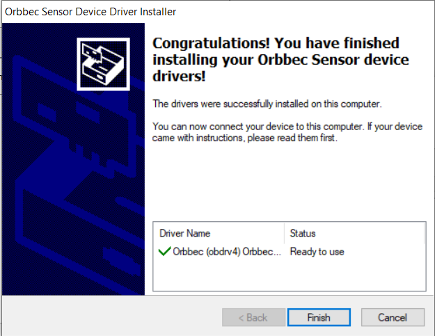

# Installation

## System Requirements

| OS    | Requirements                                     | Details                                               |
| ------- | ------------------------------------------------------------ | ------------------------------------------------------------ |
| Windows | 1、Windows 7, 8 and 10, 32-bit and 64-bit <br />2、x86-based processor @ 1.8+ ghz <br />3、USB 2.0 <br />4、4 gigabytes of RAM | Supports development with Visual Studio 2013/2015/2017/2019. Visual Studio 2017/2019 use the same package with Visual Studio 2015. |
| Linux   | 1、Ubuntu 14.04 or later(Ubuntu 20.04), x86_64, arm, arm64 <br />2、amd64-based processor @ 1.8+ ghz<br />3、USB 2.0 <br />4、1 gigabyte of RAM | GCC 4.9 and Clang 3.5 have both been extensively tested, but any compiler with support for C++11 should be compatible,including GCC 4.9 or better, Clang 3.1 or better, and Android NDK r9e or better. |
| Android | 1、Android OS 4.4.2 (KitKat) + <br />2、ARMv7a/ARM64v8a processor @ 1.5 ghz+ <br />3、USB 2.0 host support (OTG-capable) <br />4、512 megabytes of RAM | GCC 4.9 and Clang 3.5 have both been extensively tested, but any compiler with support for C++11 should be compatible,including  GCC 4.9 or better, Clang 3.1 or better, and Android NDK r9e or better. |

# Windows Installation

## Installing the Driver

First, download the latest [Orbbec Sensor Driver for Windows](https://orbbec3d.com/develop/), then run the installer:

1.Click install to start install process.


2.While in the dirver installer wizard window, click next.


3.If you see panel like this, the dirver installed right.



4.After install finished, click finish to complete


5.When you complete install the driver, you can connect the device to your PC,
then in your device manager, you will see the new orbbec deivce.


## Download the SDK

We provide SDK versions list blow:

-   OpenNI SDK for Windows 32-bit
-   OpenNI SDK for Windows 64-bit
-   OpenNI SDK for Linux 32-bit
-   OpenNI SDK for Linux 64-bit
-   OpenNI SDK for Linux arm
-   OpenNI SDK for Linux arm64
-   OpenNI SDK for Android arm64-v8a
-   OpenNI SDK for Android armeabi-v7a

[Download](https://orbbec3d.com/develop/) the corresponding version SDK.

## Setup for Visual Studio

1.Copy OpenNI2 SDK sdk/windows to a folder,  for example called  \$OpenNI_SDK_HOME.

2.Open a new project or an existing one.

3.In the Visual Studio menu, open the Project menu and choose Project properties.


4.In the C/C++ section, under the General node, find the "Additional Include Directories" and add "$(OpenNI_SDK_HOME)\include".


5.In the Linker section, under the General node, find the "Additional Library Directories" and add "$(OpenNI_SDK_HOME)\x64-Release".


6.In the Linker section, under the Input node, find the "Additional
Dependencies" and add OpenNI2.lib。


## Run the NiViewer.exe

In the $(OpenNI_SDK_HOME)\x64-Release\ folder，run the NiViewer.exe, you will see below：


# Linux Installation

## Installing the Driver

Devices under the Linux platform are loaded as common CMOS cameras. Currently, the popular Linux platforms have built-in corresponding drivers, and no additional installation is required.

But installation prerequisites are required：

freeglut3 


## Configure the OpenNI2 SDK in the Makefile

### Library files

- libOpenNI2.so
- OpenNI2/Drivers/libOniFile.so
- OpenNI2/Drivers/liborbbec.so

### Configuration files

- OpenNI.ini
- OpenNI2/Drivers/orbbec.ini

### Configuration in the Makefile

- Add the header Include directory to the Include directory
INC_DIRS = ../../Include \

- Add OpenNI2 to the Lib you use
USED_LIBS += OpenNI2

### Run NiViewer
In the sdk\linux\Intel\x64-Release folder, At the command line enter the following command to run NiViewer.

```
username@ubuntu:~/Intel/x64-Release$ sudo ./NiViewer
```
You will see the following display:


# Android Installation

## Installing the Driver

Under the Android platform, since the underlying layer is based on the Linux platform, the corresponding driver of the camera has been built in, so no additional installation is required.

## Setup for Android Studio

### Library files

The libraries provided by the OpenNI2 SDK for Android users include two parts, five so dynamic library files and one jar file:
- libOniFile.so
- libOpenNI2.jni.so
- libOpenNI2.so
- liborbbec.so
- liborbbecusb2.so
- openni2.3.jar

### ini files

Two ini configuration files
- OpenNI.ini
- orbbec.ini

### Configure the OpenNI2 SDK in the Android Studio project

- Copy the library files to the libs directory of the project Module

- Copy the ini  files to the app->src->main->asset->openni directory of the project Module

- Respecify the jniLibs directory in the build.gradle configuration of the Module, and finally synchronize the entire project


## Run Android Sample
Comming soon.