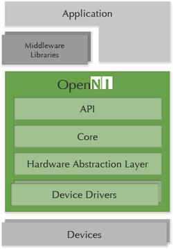

# API

## API Architecture



The OpenNI2 framework provides two sets of software interfaces at its core:

1.Application layer interface.For application layer developers, the differences in 3D sensors from different manufacturers are shielded.

2.Driver layer interface.As long as the 3D Sensor that implements the driver layer interface complies with the OpenNI2 protocol, it can access the device from the OpenNI2 application layer interface.

The OpenNI2 framework has a significant hierarchy.All API interfaces are implemented in strict accordance with this hierarchy.When you look at the code with this hierarchy in mind, it becomes clear.

OpenNI2 dynamically loads the device Driver through the Driver Handler module.The advantage of this is that you can separate the OpenNI2 code from the driver of the 3D Sensor and develop and maintain it as two separate projects.


## API How-To C++


### Hello World

Want to get a taste of our SDK before diving depther? Then let's get our hands dirty and write some code!

By the end of this tutorials you should be familiar with：

1.Initialization and termination of the SDK.

2.Reading data from the sensor.

3.Examining the depth information provided by the Astra's depth camera.

#### Before We Begin

If you skipped over the section where we install the SDK and build the sample applications provided by the SDK, make sure you've at least downloaded and extracted OpenNI2 SDK to a folder you can easily access.

#### Getting Down to Business

Our first step will be to set up a basic application as a starting point for progressively adding new functionality. 
1.Using your favorite IDE, set up a new console application project and create a new source file called "main.cpp". 

2.Copy the following into your main.cpp file:


```
#include <OpenNI.h>

#include <stdio.h>
#include <cstdio>
#include <iostream>

int main(int argc, char** argv)
{
   std::cout << "hit enter to exit program" << std::endl;
   system("pause");

   return 0;
}
```

-   OpenNI.h must be included in all applications. It is the core of OpenNI2 SDK and is required for all C++ based OpenNI2 applications.
-   We'll use system("pause") to make sure we have an opportunity to see our handiwork before our application closes its window.

#### Initializing and Terminating OpenNI

To prepare OpenNI2 to do our bidding, we must first initialize OpenNI2, which is unsurprisingly done via the initialize() function. When we're ready to end our session with the SDK, we then need to give OpenNI2 an opportunity to cleanly shutdown. This is accomplished by calling the terminate function shutdown() .
Add the two new lines below:

```
int main(int argc, char** argv)
{
    Status rc = OpenNI::initialize();
    if (rc != STATUS_OK)
    {
        printf("Initialize failed\n%s\n", OpenNI::getExtendedError());
        return 1;
    }

   // what will go here? you'll find out soon!

   	OpenNI::shutdown();

   std::cout << "hit enter to exit program" << std::endl;
   system("pause");

   return 0;
}
```

#### Trust But Verify

Before we get ahead of ourselves, let's take a moment to make sure that everything is as we expect it. Compile and run the application. The application should start up, print out a series of diagnostic messages to the console, and then patiently wait for you to press the "Enter" key. Once pressed, the application should gracefully exit. 

> **Attention**  
> OpenNI2 by default logs a fair amount of diagnostic information to the console. If you do run into an issue, this can be a great place to start looking for answers. Next up: Talking to OpenNI2.

#### Connecting to the OpenNI2-Open Device

Now that we know how to properly initialize and terminate OpenNI2, it's time to actually communicate with the OpenNI2 sensor.To do this, we use the Device class, which is an abstraction of a Device and provides the ability to connect to a Device and get configuration information about the Device and the kind of flow it supports.For now, however, we can think of Device as a physical Device and use it to control the Device.

Between initializing and terminating OpenNI2, we declare a Device variable.

```
int main(int argc, char** argv)
{
    Status rc = OpenNI::initialize();
    if (rc != STATUS_OK)
    {
        printf("Initialize failed\n%s\n", OpenNI::getExtendedError());
        return 1;
    }

   	Device device;
    rc = device.open(ANY_DEVICE);
    if (rc != STATUS_OK)
    {
        printf("Couldn't open device\n%s\n", OpenNI::getExtendedError());
        return 2;
    }

    device.close();
    OpenNI::shutdown();

    std::cout << "hit enter to exit program" << std::endl;
    system("pause");

    return 0;
}
```

Now, to be sure, it looks like we've added a few lines of code to the previous step, but those lines are much more important than it looks.Simply by declaring and constructing a Device object and calling the open method of the Device object, you can instruct OpenNI2 to start connecting to the first available OpenNI2 sensor it can locate.

> **Attention**  
>
> OpenNI2 provides an additional constructor that will allow you to connect to a specific OpenNI2 sensor.

#### Retrieving Sensor Data

Time to put our Device object to good use and get some data. To do this, we'll need to read one of the streams that the OpenNI2 is providing. Streams contain the data coming from our camera packaged in packets of data called "frames". OpenNI2 currently supports a number of types of streams, including depth, color, hand, and point streams.

In order to access streams from the OpenNI2 and get to the frames, we'll need a VideoStream to tap into one of the streams. For the purposes of our application,we're going to focus on the depth stream. This stream gives us the distances of anything that our camera sees in pixels, and those pixels are packaged in a frame.

First, let's create a VideoStream using our Device.

```
int main(int argc, char** argv)
{
    Status rc = OpenNI::initialize();
    if (rc != STATUS_OK)
    {
        printf("Initialize failed\n%s\n", OpenNI::getExtendedError());
        return 1;
    }

   	Device device;
    rc = device.open(ANY_DEVICE);
    if (rc != STATUS_OK)
    {
        printf("Couldn't open device\n%s\n", OpenNI::getExtendedError());
        return 2;
    }

    VideoStream depth;

    if (device.getSensorInfo(SENSOR_DEPTH) != NULL)
    {
        rc = depth.create(device, SENSOR_DEPTH);
        if (rc != STATUS_OK)
        {
            printf("Couldn't create depth stream\n%s\n", OpenNI::getExtendedError());
            return 3;
        }
    }

    depth.destroy();
    device.close();
    OpenNI::shutdown();

    std::cout << "hit enter to exit program" << std::endl;
    system("pause");

    return 0;
}
```

Next, we'll use the VideoStream depth we created in the next step to start the depth stream and get the depth data.

```
int main(int argc, char** argv)
{
    Status rc = OpenNI::initialize();
    if (rc != STATUS_OK)
    {
        printf("Initialize failed\n%s\n", OpenNI::getExtendedError());
        return 1;
    }

   	Device device;
    rc = device.open(ANY_DEVICE);
    if (rc != STATUS_OK)
    {
        printf("Couldn't open device\n%s\n", OpenNI::getExtendedError());
        return 2;
    }

    VideoStream depth;

    if (device.getSensorInfo(SENSOR_DEPTH) != NULL)
    {
        rc = depth.create(device, SENSOR_DEPTH);
        if (rc != STATUS_OK)
        {
            printf("Couldn't create depth stream\n%s\n", OpenNI::getExtendedError());
            return 3;
        }
    }
    
    rc = depth.start();
    if (rc != STATUS_OK)
    {
        printf("Couldn't start the depth stream\n%s\n", OpenNI::getExtendedError());
        return 4;
    }
    
    depth.stop();
    depth.destroy();
    device.close();
    OpenNI::shutdown();

    std::cout << "hit enter to exit program" << std::endl;
    system("pause");

    return 0;
}
```

We first need to retrieve the latest frame via VideoStream, and then call getData to get the depth frame data from our frame.

```
int main(int argc, char** argv)
{
    Status rc = OpenNI::initialize();
    if (rc != STATUS_OK)
    {
        printf("Initialize failed\n%s\n", OpenNI::getExtendedError());
        return 1;
    }

   	Device device;
    rc = device.open(ANY_DEVICE);
    if (rc != STATUS_OK)
    {
        printf("Couldn't open device\n%s\n", OpenNI::getExtendedError());
        return 2;
    }

    VideoStream depth;

    if (device.getSensorInfo(SENSOR_DEPTH) != NULL)
    {
        rc = depth.create(device, SENSOR_DEPTH);
        if (rc != STATUS_OK)
        {
            printf("Couldn't create depth stream\n%s\n", OpenNI::getExtendedError());
            return 3;
        }
    }
    
    rc = depth.start();
    if (rc != STATUS_OK)
    {
        printf("Couldn't start the depth stream\n%s\n", OpenNI::getExtendedError());
        return 4;
    }
    
    int changedStreamDummy;
    VideoStream* pStream = &depth;
    rc = OpenNI::waitForAnyStream(&pStream, 1, &changedStreamDummy, SAMPLE_READ_WAIT_TIMEOUT);
    if (rc != STATUS_OK)
    {
        printf("Wait failed! (timeout is %d ms)\n%s\n", SAMPLE_READ_WAIT_TIMEOUT, OpenNI::getExtendedError());
        continue;
    }

    rc = depth.readFrame(&frame);
    if (rc != STATUS_OK)
    {
        printf("Read failed!\n%s\n", OpenNI::getExtendedError());
        continue;
    }

    if (frame.getVideoMode().getPixelFormat() != PIXEL_FORMAT_DEPTH_1_MM && frame.getVideoMode().getPixelFormat() != PIXEL_FORMAT_DEPTH_100_UM)
    {
        printf("Unexpected frame format\n");
        continue;
    }

    DepthPixel* pDepth = (DepthPixel*)frame.getData();

    depth.stop();
    depth.destroy();
    device.close();
    OpenNI::shutdown();

    std::cout << "hit enter to exit program" << std::endl;
    system("pause");

    return 0;
}

```

The obtained depth data is then printed out.

```
int main(int argc, char** argv)
{
    Status rc = OpenNI::initialize();
    if (rc != STATUS_OK)
    {
        printf("Initialize failed\n%s\n", OpenNI::getExtendedError());
        return 1;
    }

   	Device device;
    rc = device.open(ANY_DEVICE);
    if (rc != STATUS_OK)
    {
        printf("Couldn't open device\n%s\n", OpenNI::getExtendedError());
        return 2;
    }

    VideoStream depth;

    if (device.getSensorInfo(SENSOR_DEPTH) != NULL)
    {
        rc = depth.create(device, SENSOR_DEPTH);
        if (rc != STATUS_OK)
        {
            printf("Couldn't create depth stream\n%s\n", OpenNI::getExtendedError());
            return 3;
        }
    }
    
    rc = depth.start();
    if (rc != STATUS_OK)
    {
        printf("Couldn't start the depth stream\n%s\n", OpenNI::getExtendedError());
        return 4;
    }
    
    int changedStreamDummy;
    VideoStream* pStream = &depth;
    rc = OpenNI::waitForAnyStream(&pStream, 1, &changedStreamDummy, SAMPLE_READ_WAIT_TIMEOUT); 
    if (rc != STATUS_OK)
    {
        printf("Wait failed! (timeout is %d ms)\n%s\n", SAMPLE_READ_WAIT_TIMEOUT, OpenNI::getExtendedError());
        return 5;
    }

    rc = depth.readFrame(&frame);
    if (rc != STATUS_OK)
    {
        printf("Read failed!\n%s\n", OpenNI::getExtendedError());
        return 6;
    }

    if (frame.getVideoMode().getPixelFormat() != PIXEL_FORMAT_DEPTH_1_MM && frame.getVideoMode().getPixelFormat() != PIXEL_FORMAT_DEPTH_100_UM)
    {
        printf("Unexpected frame format\n");
        return 7;
    }

    DepthPixel* pDepth = (DepthPixel*)frame.getData();
    
    int middleIndex = (frame.getHeight() + 1)*frame.getWidth() / 2;

    printf("[%08llu] %8d\n", (long long)frame.getTimestamp(), pDepth[middleIndex]);

    depth.stop();
    depth.destroy();
    device.close();
    OpenNI::shutdown();

    std::cout << "hit enter to exit program" << std::endl;
    system("pause");

    return 0;
}

```

Finally, run your application to check that everything is ok.Normally, the console window that pops up prints a line of captured data frames.When the run is complete, press enter.

We showed you how to get a frame of data from an OpenNI2 device! Next we'll learn how to deal with a series of frames.

#### Get stream data (a series of data frames)

Just loop through the VideoStream's readFrame function to use the data stream.In the following example, we will take the first 100 frames from the depth stream and print the first pixel value of each frame to the console.

The following code is very similar to the code in our previous example, except that in addition to adding a do while loop outside the frame handling code, we also added variables to store the number of loops and the maximum number of frames we want to process.

```

int main(int argc, char** argv)
{
    Status rc = OpenNI::initialize();
    if (rc != STATUS_OK)
    {
        printf("Initialize failed\n%s\n", OpenNI::getExtendedError());
        return 1;
    }

   	Device device;
    rc = device.open(ANY_DEVICE);
    if (rc != STATUS_OK)
    {
        printf("Couldn't open device\n%s\n", OpenNI::getExtendedError());
        return 2;
    }

    VideoStream depth;

    if (device.getSensorInfo(SENSOR_DEPTH) != NULL)
    {
        rc = depth.create(device, SENSOR_DEPTH);
        if (rc != STATUS_OK)
        {
            printf("Couldn't create depth stream\n%s\n", OpenNI::getExtendedError());
            return 3;
        }
    }
    
    rc = depth.start();
    if (rc != STATUS_OK)
    {
        printf("Couldn't start the depth stream\n%s\n", OpenNI::getExtendedError());
        return 4;
    }
    
    int changedStreamDummy;
    VideoStream* pStream = &depth;
    
   //Stores the maximum number of frames we're going to process in the loop
   const int maxFramesToProcess = 100;
   //Sentinel to count the number of frames that we've processed
   int count = 0;

   //The frame processing loop
    do{
        rc = OpenNI::waitForAnyStream(&pStream, 1, &changedStreamDummy, SAMPLE_READ_WAIT_TIMEOUT); 
        if (rc != STATUS_OK)
        {
            printf("Wait failed! (timeout is %d ms)\n%s\n", SAMPLE_READ_WAIT_TIMEOUT, OpenNI::getExtendedError());
            continue;
        }

        rc = depth.readFrame(&frame);
        if (rc != STATUS_OK)
        {
            printf("Read failed!\n%s\n", OpenNI::getExtendedError());
            continue;
        }

        if (frame.getVideoMode().getPixelFormat() != PIXEL_FORMAT_DEPTH_1_MM && frame.getVideoMode().getPixelFormat() != PIXEL_FORMAT_DEPTH_100_UM)
        {
            printf("Unexpected frame format\n");
            continue;
        }

        DepthPixel* pDepth = (DepthPixel*)frame.getData();

        printf("[%08llu] %8d\n", (long long)frame.getTimestamp(), pDepth[0]);
        
        count++;
    }while (count < maxFramesToProcess);

    depth.stop();
    depth.destroy();
    device.close();
    OpenNI::shutdown();

    std::cout << "hit enter to exit program" << std::endl;
    system("pause");

    return 0;
}

```

Compile and run. While the program is running and the OpenNI2 is focused on you, move around a bit and watch the data values on the frames change.

Achievement get! You've just made your first OpenNI2 application! If you haven't had your fill of fun with OpenNI2 yet, continue on to Retrieving Stream Data.

### Retrieving Stream Data

#### Stream Types

The OpenNI2 SDK supports three data flow types.These data streams are generated by the sensor and passed through the SDK to the application.You can select the appropriate data flow according to your needs.


| Stream Type  | Description                                                  |
| ------------ | :----------------------------------------------------------- |
| SENSOR_COLOR | RGB pixel data from the sensor. The data array included in each ColorFrame contains values ranging from 0-255 for each color component of each pixel. Never start it when InfraredStream is started. |
| SENSOR_DEPTH | Depth data from the sensor. The data array included in each DepthFrame contains values in millimeters for each pixel within the sensor's field of view. |
| SENSOR_IR    | IR data from the sensor.                                     |

#### Getting the Data

Two methods are provided by the OpenNI2 SDK to get stream data. Depending on your particular use case and the complexity of your application, one method may be better suited than the other.

**Polling**


The polling method to get the frame data is the most direct way to get the stream data, and is used in the Hello World tutorial.To use this method, you simply call OpenNI::waitForAnyStream and read the stream data through the VideoStream::readFrame() method.If new data is generated, the readFrame() method provides a VideoFrameRef that can access the newly generated video frames.If no new frames are generated, the OpenNI::waitForAnyStream method blocks until a new frame is generated.If you want to limit the time the SDK waits for a new frame to arrive, you can pass the timeout as a parameter to the OpenNI::waitForAnyStream function.

```
Status rc = OpenNI::initialize();
if (rc != STATUS_OK)
{
    printf("Initialize failed\n%s\n", OpenNI::getExtendedError());
    return 1;
}

Device device;
rc = device.open(ANY_DEVICE);
if (rc != STATUS_OK)
{
    printf("Couldn't open device\n%s\n", OpenNI::getExtendedError());
    return 2;
}

VideoStream depth;

if (device.getSensorInfo(SENSOR_DEPTH) != NULL)
{
    rc = depth.create(device, SENSOR_DEPTH);
    if (rc != STATUS_OK)
    {
        printf("Couldn't create depth stream\n%s\n", OpenNI::getExtendedError());
        return 3;
    }
}

rc = depth.start();
if (rc != STATUS_OK)
{
    printf("Couldn't start the depth stream\n%s\n", OpenNI::getExtendedError());
    return 4;
}

int changedStreamDummy;
VideoStream* pStream = &depth;
rc = OpenNI::waitForAnyStream(&pStream, 1, &changedStreamDummy, SAMPLE_READ_WAIT_TIMEOUT); 
if (rc != STATUS_OK)
{
    printf("Wait failed! (timeout is %d ms)\n%s\n", SAMPLE_READ_WAIT_TIMEOUT, OpenNI::getExtendedError());
    return 5;
}

rc = depth.readFrame(&frame);
if (rc != STATUS_OK)
{
    printf("Read failed!\n%s\n", OpenNI::getExtendedError());
    return 6;
}
```

**Event**

Getting frame data using an event-based approach requires a small amount of additional setup, but allows developers to delegate the processing of frames to one or more separate classes.OpenNI2 SDK provides a named VideoStream: : NewFrameListener abstract classes, this class implements a only called NewFrameListener: : onNewFrame function.Once the VideoStream stream has a data frame and ready to be processed, immediately call NewFrameListener: : onNewFrame function.

An example of a listener class derived from NewFrameListener:

```

class PrintCallback : public VideoStream::NewFrameListener
{
public:
    void onNewFrame(VideoStream& stream)
    {
    	stream.readFrame(&m_frame);
    }
private:
	VideoFrameRef m_frame;
};
```

Defines a listener class, in order to use it, must instantiate the listener in the application, and then use the VideoStream: : addNewFrameListener function will be added to the VideoStream.

Example use of listener:

```
Status rc = OpenNI::initialize();
if (rc != STATUS_OK)
{
    printf("Initialize failed\n%s\n", OpenNI::getExtendedError());
    return 1;
}

Device device;
rc = device.open(ANY_DEVICE);
if (rc != STATUS_OK)
{
    printf("Couldn't open device\n%s\n", OpenNI::getExtendedError());
    return 2;
}

VideoStream depth;

if (device.getSensorInfo(SENSOR_DEPTH) != NULL)
{
    rc = depth.create(device, SENSOR_DEPTH);
    if (rc != STATUS_OK)
    {
        printf("Couldn't create depth stream\n%s\n", OpenNI::getExtendedError());
        return 3;
    }
}

rc = depth.start();
if (rc != STATUS_OK)
{
    printf("Couldn't start the depth stream\n%s\n", OpenNI::getExtendedError());
    return 4;
}

PrintCallback depthPrinter;

// Register to new frame
depth.addNewFrameListener(&depthPrinter);

// Wait while we're getting frames through the printer
while (true)
{
    Sleep(100);
}
```

In fact, the while loop in the above code does not need to be executed all the time and needs to exit the loop when the application closes or another application-specific event occurs.

For a more practical example of a listener, continue reading the Event Based Read.

### Event Based Read Sample

Thirsting for more knowledge after finishing the Hello World Tutorial? Now that you've mastered some of the basic concepts of OpenNI2 SDK, let's read the depth stream from our OpenNI2 using another feature.

By the end of this tutorial you should be familiar with: 

* The purpose of the NewFrameListener class
* How to define a NewFrameListener 
* Using a NewFrameListener to process a depth stream.

Before We Begin 

1.Download and decompress the latest OpenNI2 SDK, if you haven't already. 

2.Using your favorite IDE, set up a new console application project and create a new source file called "main.cpp". 

3.Copy the following into yourmain.cpp file:

```
#include <stdio.h>
#include "OpenNI.h"

int main(int argc, char** argv)
{
    Status rc = OpenNI::initialize();
    if (rc != STATUS_OK)
    {
        printf("Initialize failed\n%s\n", OpenNI::getExtendedError());
        return 1;
    }

   	Device device;
    rc = device.open(ANY_DEVICE);
    if (rc != STATUS_OK)
    {
        printf("Couldn't open device\n%s\n", OpenNI::getExtendedError());
        return 2;
    }

    VideoStream depth;

    if (device.getSensorInfo(SENSOR_DEPTH) != NULL)
    {
        rc = depth.create(device, SENSOR_DEPTH);
        if (rc != STATUS_OK)
        {
            printf("Couldn't create depth stream\n%s\n", OpenNI::getExtendedError());
            return 3;
        }
    }
    
    rc = depth.start();
    if (rc != STATUS_OK)
    {
        printf("Couldn't start the depth stream\n%s\n", OpenNI::getExtendedError());
        return 4;
    }

    // More of your code will go here

    depth.stop();
    depth.destroy();
    device.close();
    OpenNI::shutdown();

    std::cout << "hit enter to exit program" << std::endl;
    system("pause");

    return 0;
}
```

#### Listening to Streams

In the Hello World tutorial, we wait for a data frame by looping OpenNI::waitForAnyStream, and VideoStream's readFrame function reads a data frame.In simple cases, such as our Hello World application, this solution works very well.But what if we read and process data frames from multiple videostreams at the same time?In all of these cases, the code in the loop can quickly become complex, messy, and cumbersome.

To address these issues, the OpenNI2 SDK provides a framework for defining and creating the NewFrameListener.The NewFrameListener has a function called onNewFrame that is called when you are ready to process a new frame of a particular type.So instead of looping over OpenNI::waitForAnyStream, our listener automatically passes the latest frame to the onNewFrame function as soon as the frame is ready.

To use the NewFrameListener in our example.

1.We need to define a listener class that implements NewFrameListener.This listener class will enable us to access the actual frames from the OpenNI2 sensor.We will get those frames in the onNewFrame function.Copy the following code below the #include directive and above the main function main:

```
using namespace openni;

void analyzeFrame(const VideoFrameRef& frame)
{
	DepthPixel* pDepth;

	int middleIndex = (frame.getHeight()+1)*frame.getWidth()/2;

	switch (frame.getVideoMode().getPixelFormat())
	{
	case PIXEL_FORMAT_DEPTH_1_MM:
	case PIXEL_FORMAT_DEPTH_100_UM:
		pDepth = (DepthPixel*)frame.getData();
		printf("[%08llu] %8d\n", (long long)frame.getTimestamp(),
			pDepth[middleIndex]);
		break;

	default:
		printf("Unknown format\n");
	}
}

class DepthFrameListener : public VideoStream::NewFrameListener
{
public:
	void onNewFrame(VideoStream& stream)
	{
		stream.readFrame(&m_frame);

		analyzeFrame(m_frame);
	}
private:
	VideoFrameRef m_frame;
};
```

> Note  
>
> The only required function is the onNewFrame function. The other functions in this class support what we do within that function.

With the DepthFrameListener defined, let's construct our listener in the main function and add it to the VideoStream that we created in a previous step.

```
#include <stdio.h>
#include "OpenNI.h"

int main(int argc, char** argv)
{
    Status rc = OpenNI::initialize();
    if (rc != STATUS_OK)
    {
        printf("Initialize failed\n%s\n", OpenNI::getExtendedError());
        return 1;
    }

   	Device device;
    rc = device.open(ANY_DEVICE);
    if (rc != STATUS_OK)
    {
        printf("Couldn't open device\n%s\n", OpenNI::getExtendedError());
        return 2;
    }

    VideoStream depth;

    if (device.getSensorInfo(SENSOR_DEPTH) != NULL)
    {
        rc = depth.create(device, SENSOR_DEPTH);
        if (rc != STATUS_OK)
        {
            printf("Couldn't create depth stream\n%s\n", OpenNI::getExtendedError());
            return 3;
        }
    }
    
    rc = depth.start();
    if (rc != STATUS_OK)
    {
        printf("Couldn't start the depth stream\n%s\n", OpenNI::getExtendedError());
        return 4;
    }

    DepthFrameListener depthPrinter;

    // Register to new frame
    depth.addNewFrameListener(&depthPrinter);
    
    // More of your code will go here

    depth.stop();
    depth.destroy();
    device.close();
    OpenNI::shutdown();

    std::cout << "hit enter to exit program" << std::endl;
    system("pause");

    return 0;
}
```

#### Wait until the keystroke event occurs

We have Device turned on and are listening for the depth frames flowing in through Device's VideoStream.

But the above program, may not even a data frame processing has ended.So we add a loop, and we don't stop the loop until a keypad button is clicked.To capture keystroke events, we introduce a header file #include <conio. H&gt;, and defines the wasKeyboardHit function. In addition, the listener needs to be removed by calling removeNewFrameListener before the program finishes.

```
#include <stdio.h>
#include "OpenNI.h"
#include <conio.h>

int wasKeyboardHit()
{
    return (int)_kbhit();
}

int main(int argc, char** argv)
{
    Status rc = OpenNI::initialize();
    if (rc != STATUS_OK)
    {
        printf("Initialize failed\n%s\n", OpenNI::getExtendedError());
        return 1;
    }

   	Device device;
    rc = device.open(ANY_DEVICE);
    if (rc != STATUS_OK)
    {
        printf("Couldn't open device\n%s\n", OpenNI::getExtendedError());
        return 2;
    }

    VideoStream depth;

    if (device.getSensorInfo(SENSOR_DEPTH) != NULL)
    {
        rc = depth.create(device, SENSOR_DEPTH);
        if (rc != STATUS_OK)
        {
            printf("Couldn't create depth stream\n%s\n", OpenNI::getExtendedError());
            return 3;
        }
    }
    
    rc = depth.start();
    if (rc != STATUS_OK)
    {
        printf("Couldn't start the depth stream\n%s\n", OpenNI::getExtendedError());
        return 4;
    }

    DepthFrameListener depthPrinter;

    // Register to new frame
    depth.addNewFrameListener(&depthPrinter);
    
	// Wait while we're getting frames through the printer
    while (!wasKeyboardHit())
    {
    	Sleep(100);
    }

    depth.removeNewFrameListener(&depthPrinter);
    
    depth.stop();
    depth.destroy();
    device.close();
    OpenNI::shutdown();

    std::cout << "hit enter to exit program" << std::endl;
    system("pause");

    return 0;
}
```

Let's compile and run our solution. After you've watched some depth frame information print to the console, revel in the knowledge that you've mastered the listener along with other core OpenNI2 SDK functionality. Now, go forth, let your imagination run wild and use OpenNI2 SDK to do all sorts of innovative things!


## API Changelog

```

What's New
==========
v2.3.0.66 2020/12/31
1 Support selinux, solve the security permission restriction problem of Android system.
2 Release the NIViewer's Android source code.
3 Fix some bugs,include LDP problem of some module.
-------------------------
v2.3.0.65 2020/10/15
1 Support Astra+;
2 Add fan switch interface for Astra+;
3 Add RGB SN interface for Astra+,so we can use this interface to read SN of RGB; 
4 Add cross cargo module;
5 Add interface that return resolution list based on PID.
-------------------------
v2.3.0.63 2020/04/15 First version ready for external use.

```

## API Reference